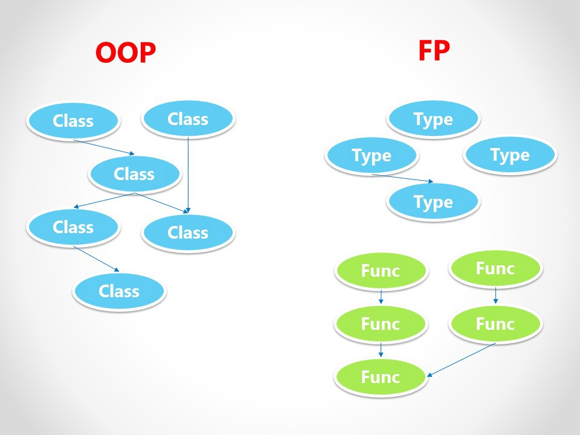

# Functional programming in Scala.

## Introduction

This is a collection of notes and exercises about functional programming in Scala.

The goal is to provide a quick introduction to functional programming in Scala.

## Prerequisites

* Basic knowledge of types and functions
* Basic knowledge of Scala


## Objectives: Happy Eyeballs Algorithm

* Understand the basic concepts of functional programming
* Understand the basic concepts of Scala
* Understand the basic concepts of Cat || ZIO


https://blog.softwaremill.com/happy-eyeballs-algorithm-using-zio-120997ba5152

TL;DR: Happy Eyeballs is an algorithm that allows us to connect to the fastest server from a list of servers. It is used in web browsers to connect to the fastest server when there are multiple servers available.

(TL;DR)<sup>2</sup>:

```bash
dig +short www.google.com
```

Naive approach:


Just perfect approach:


```scala
def happyEyeballs[R, T](
  tasks: List[ZIO[R, Throwable, T]], 
  delay: Duration): ZIO[R with Clock, Throwable, T] = tasks match {
  case Nil         => IO.fail(new IllegalStateException("no tasks"))
  case task :: Nil => task
  case task :: otherTasks => 
    Queue.bounded[Unit](1).flatMap { taskFailed =>
      val taskWithSignalOnFailed = 
        task.onError(_ => taskFailed.offer(()))
      val sleepOrFailed = ZIO.sleep(delay).race(taskFailed.take)

      taskWithSignalOnFailed.race(
        sleepOrFailed *> happyEyeballs(otherTasks, delay))
  }
}
```


## What is functional programming?




"Functional programming is a programming paradigm where programs are constructed by **applying and composing functions**. It is a declarative programming paradigm in which function definitions are trees of expressions that each return a value, rather than a sequence of imperative statements which change the state of the program." (Wikipedia)

Functional programming is a programming paradigm that treats computation as the evaluation of mathematical functions and **avoids changing-state and mutable data**.

Functional programming is a **declarative** programming paradigm, which means programming is done with expressions or declarations instead of statements.

Functional code is **idempotent**: the same input always gives the same output.

Functional code is also modular: it's easier to test, reuse and parallelize.

## Why functional programming?

* Moore's law is over
* Multicore processors
* Distributed systems
* Parallelism
* Concurrency

Q: Where idempotency is useful ?

## Basic scala

* Traits
* Case Classes
* Sample: Options 
* Pattern Matching
* For Comprehensions

See [Basic Scala](../src/test/scala/basic.worksheet.sc)


See [ADT](../src/test/scala/adt.worksheet.sc)

## Functions, Methods et lambdas

* Method

Method is a member of a class or object.

* Function

Function is a value.

* Lambda

Lambda is a function that has no name. It is also called anonymous function. It is used when we need a function for a short period of time.

Litteral for function type.


See [Functions worksheet](../src/test/scala/lambda.worksheet.sc)


## Higher Order Functions

* map
* flatMap
* filter
...


## Types

A type is a set of values. A type defines a set of operations that can be performed on its values.

### Algebraic Data Types

### Generic Types
 Covariance and Contravariance

 https://blog.rockthejvm.com/contravariance/

 See [variance](../src/test/scala/variance.worksheet.sc)


## Immutability

* val vs var
* Immutable collections

How to achieve Immutability?


### Mutable sample
```scala
class MutableBalance(var balance: Double) {
  def deposit(amount: Double): Unit = {
    balance += amount
  }
}
```

Issues:

* balance is mutable
* deposit is a procedure
* deposit is not referentially transparent
* thread safety


### Immutable sample

```scala
class ImmutableBalance(balance: Double) {
  def deposit(amount: Double): ImmutableBalance = {
    ImmutableBalance(balance + amount)
  }
}
```

[See ImmutableBalance](../src/test/scala/immutability.worksheet.sc)


### Optic, Lens, Prism ...

Immutability is not enough. We need to be able to access and modify immutable data structures. 

See [Lenses](../src/test/scala/lenses.worksheet.sc)

Optics are functional abstractions that allow us to access and modify parts of a data structure.

See [monocles](../src/test/scala/lenses.worksheet.sc)


## Persistent Data Structures

Persistent data structures are data structures that preserve the previous version of themselves when they are modified. This allows us to use the previous version of the data structure even after it has been modified.


## Recursion and Tail Recursion

* Stack safety
* Tail Recursion Optimization


## Currying

Currying is the technique of transforming a function that takes multiple arguments into a function that takes a single argument.

See [Currying](../src/test/scala/currying.worksheet.sc)

## Partially Applied Functions

## Lazy Evaluation

See [Lazy Evaluation](../src/test/scala/io.worksheet.sc)


## Typeclasses

See [Typeclasses](../src/test/scala/typeclasses.worksheet.sc)

https://docs.scala-lang.org/scala3/reference/contextual/type-classes.html#
## Monads

Functor, Monoïd, Applicative, Monad

### Functor

Functor is a type class that abstracts over type constructors that can be mapped over.

See [cats](https://typelevel.org/cats/)


### Reader Monad

Reader monad is a monad that allows us to sequence operations that depend on some input.

See [Reader Monad](../src/test/scala/reader-monad_v1.worksheet.sc)

See [Reader Monad the end](../src/test/scala/reader-monad_v2.worksheet.sc)


## IOs and Effects


* [Cats Effect](https://typelevel.org/cats-effect/)
* [ZIO](https://zio.dev/)


## Refences

* [Functional Programming in Scala](https://www.manning.com/books/functional-programming-in-scala-second-edition)
* [Zionomicon](https://www.zionomicon.com/)
